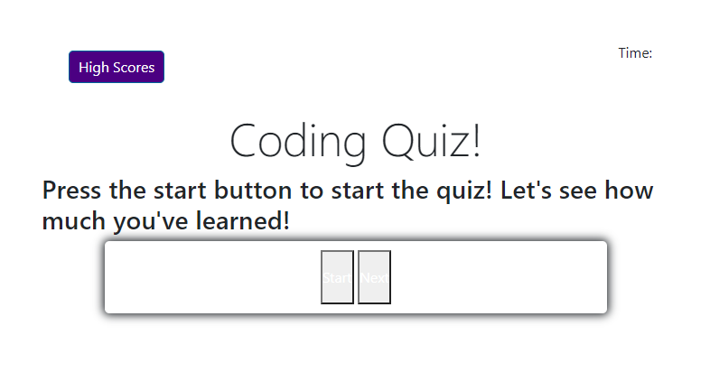

# ELL JS Quiz

## Description

I wanted to create a functional application that would allow the user to take a java quiz. This application is created using HTML, CSS, js, and tailwind. 

It is still in the process of being modified. 

## Installation

No installation is necessary, but you can access this site at https://elizabeth189.github.io/ELLCodingQuiz/ 

## Usage

The [website](https://elizabeth189.github.io/ELLCodingQuiz/) created allows you to learn more about Me by clicking on one of the headers located on the R side of the page. 

You can look through the HTML, CSS, and JS files to check out how I created this quiz! 

## License
Please refer to the LICENSE in the repo.

